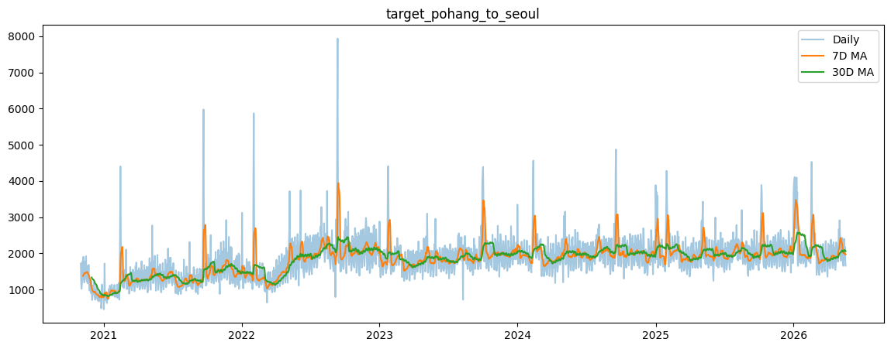
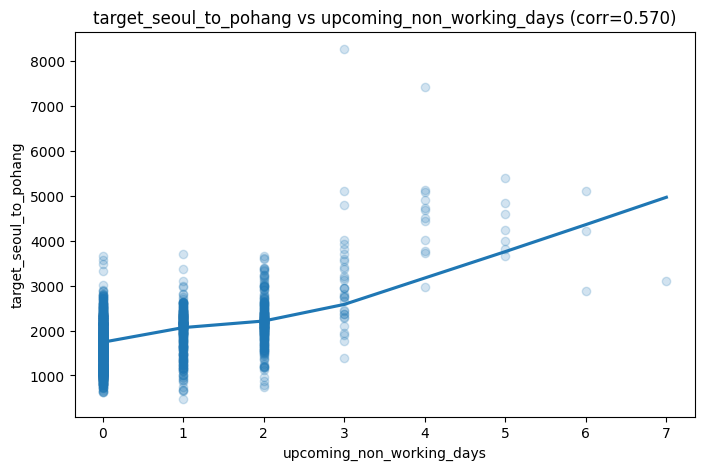
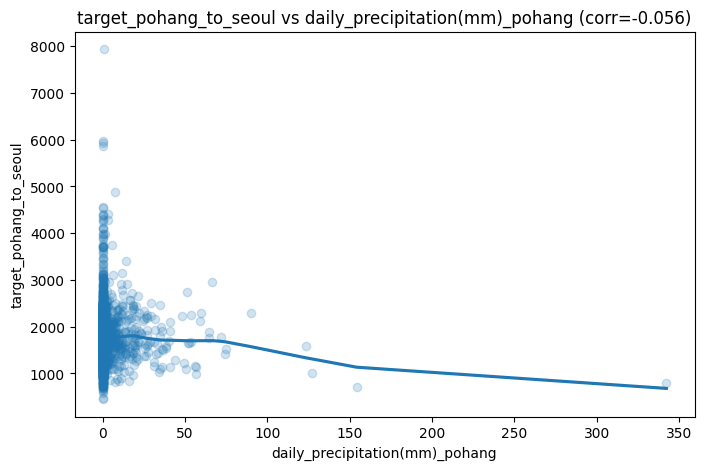
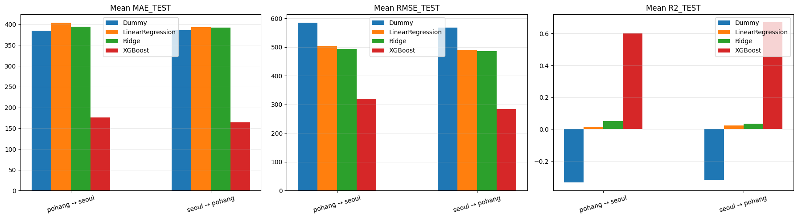
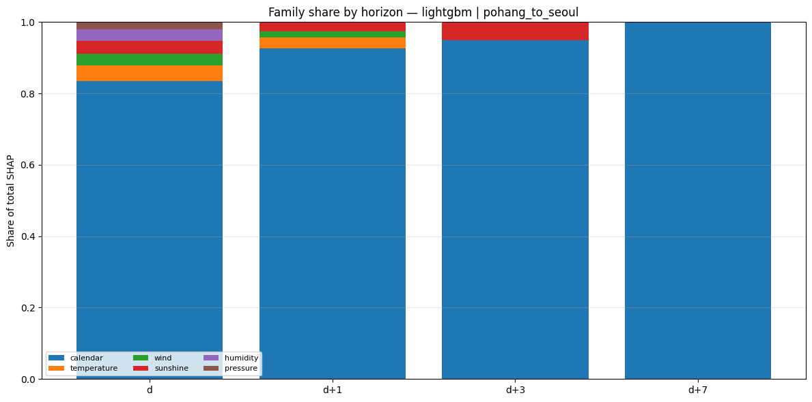
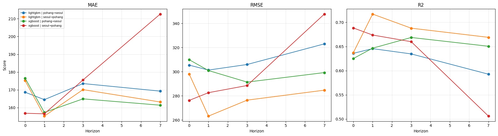
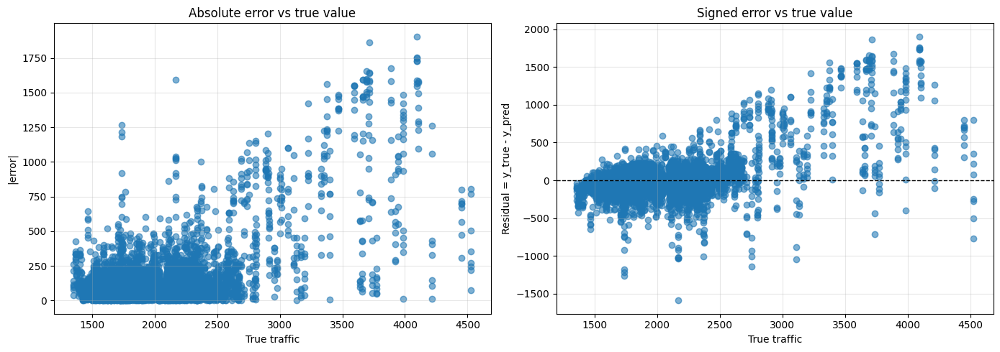

# Traffic Demand Forecasting Between Pohang and Seoul

## Overview

This project predicts daily passenger traffic between **Pohang** and **Seoul**, South Korea, using meteorological data, transportation demand data, and calendar-based features.

The goal was to understand which factors drive intercity travel demand and to evaluate how well machine learning models can forecast traffic volumes over multiple horizons.

Two travel directions were modeled independently:

* Pohang → Seoul
* Seoul → Pohang

For each direction, separate models were trained for several forecasting horizons:

* D+0
* D+1
* D+3
* D+7

---

## Results at a Glance

### Best Overall Result

| Direction      | Horizon | Model    | MAE        | RMSE       | R²        |
| -------------- | ------- | -------- | ---------- | ---------- | --------- |
| Seoul → Pohang | D+1     | LightGBM | **155.20** | **263.15** | **0.717** |

### Main Takeaways

* Gradient boosting models clearly outperformed the baseline regressors.
* LightGBM was the most consistent model overall.
* XGBoost still achieved strong results and produced the best score on some individual tasks.
* Calendar features were the strongest predictors by a wide margin.
* Prediction errors grew on high-demand days, especially at larger traffic volumes.
* The Seoul → Pohang direction was generally easier to model than Pohang → Seoul.

---

## Problem Statement

As an exchange student at POSTECH, predicting public transport usage to the capital can prove very useful to plan travels in advance.

This project focuses on forecasting daily traffic between Pohang and Seoul using:

* weather conditions
* calendar effects
* historical transportation demand

The project also compares several modeling strategies and interprets the results using SHAP values and error analysis.

---

## Data Sources

The dataset was built by combining multiple public sources and a custom extraction pipeline.

### Weather Data

Weather data was fetched from Open-Meteo using daily variables for Pohang and Seoul.
The project uses **historical weather observations**, not forecast weather, because sufficiently complete historical forecast archives were not available for the full study period.

The variables initially considered included daily temperature, precipitation, humidity, wind, pressure, sunshine, radiation, snow, and cloud cover metrics.

Source:

* Open-Meteo API documentation and weather endpoints

### Transportation Data

Transportation demand data was collected from the STCIS (Korean public transport big data system).
The project uses the O/D passenger demand indicators for rail, express bus, and intercity bus traffic.

To automate collection, custom HTTP requests were built by inspecting browser network requests, allowing all required data to be fetched and aggregated into a single file.

Source:

* STCIS O/D passenger demand indicator system

### Calendar Data

Calendar features were engineered from the date index and official holiday information.
These include:

* day of week
* month
* year
* holiday indicators
* days since last holiday
* days until next holiday
* cyclical date encodings

---

## Dataset Characteristics

| Property                  | Value                    |
| ------------------------- | ------------------------ |
| Date range                | 2020-11-01 to 2026-05-19 |
| Number of daily rows      | 2,026                    |
| Base features per day     | 35                       |
| Features before selection | 35 * (horizon + 1)       |
| Features after selection  | 20                       |
| Forecast horizons         | D+0, D+1, D+3, D+7       |

The base feature set contains 35 variables per day.
For longer horizons, the input window expands by including additional days, so the feature count increases proportionally.

The target is the total traffic volume, composed of:

* train traffic
* intercity bus traffic
* express bus traffic

In practice, this is modeled as a single aggregated traffic target.

---

## Data Preparation

The raw datasets were collected separately and merged into a unified daily table.

The main preprocessing steps were:

* translating weather feature names into English
* keeping only weather variables that could also be obtained from future forecasts
* converting fog from a daily hour count into a binary `has_occured` feature
* replacing `NaN` with `0` for columns where `NaN` meant “did not happen” and where `0` was otherwise not present
* filling missing wind direction values with the previous day’s value
* using PCHIP interpolation for continuous variables such as temperature when the missing pattern was suitable
* falling back to linear interpolation when too many consecutive values were missing for PCHIP to be reliable

These steps were designed to preserve the meaning of the original data while producing a model-ready dataset.

---

## Exploratory Data Analysis

Before modeling, the data was explored to understand traffic patterns and relationships between variables.

The notebooks include visual analysis of:

* traffic trends over time
* holiday effects
* day-of-week effects
* seasonal patterns
* weather and demand relationships
* differences between the two travel directions





---

## Modeling Strategy

The project was built in **two stages**.

### Stage 1 — Baseline Comparison

The first step was to compare simple baseline models against an untuned XGBoost model.

Models tested:

* Dummy Regressor
* Linear Regression
* Ridge Regression
* XGBoost without SHAP selection or hyperparameter tuning

This stage was used to answer a simple question:

**Are gradient-boosting models actually better than standard regression baselines for this problem?**

The answer was yes, and by quite a lot.



### Stage 2 — Tuned Gradient Boosting

After confirming that gradient boosting was a better family of models, the project moved to a more refined comparison between:

* XGBoost
* LightGBM

For this stage:

* SHAP was used to keep the 20 most important features for each model
* Optuna was used for hyperparameter tuning
* 50 trials were run for each model
* each travel direction and each forecasting horizon was optimized separately

---

## Forecasting Horizons

### D+0

Uses only the data available on the prediction day.

### D+1

Uses the prediction day and the following day.

### D+3

Uses the prediction day and the next three days.

### D+7

Uses the prediction day and the next seven days.

This setup allows the effect of additional future-day information to be evaluated across horizons.

---

## Validation Strategy

Because this is a time-dependent forecasting problem, the evaluation was done with temporal validation rather than random shuffling.

### Train / Test Split

* 85% training data
* 15% hold-out test data

The final test set was kept untouched during model development.

### Temporal Cross-Validation

Chronological cross-validation splits were used to reduce leakage and better simulate a real forecasting setting.

---

## Feature Selection and Hyperparameter Tuning

### SHAP-Based Feature Selection

For each model, SHAP values were computed to rank the features by importance.
The top 20 features were then kept, and the model was retrained on the reduced feature set.

This made the final models easier to interpret while reducing noise from weaker variables.

### Optuna Optimization

Hyperparameters were tuned with Optuna using 50 trials per model.
This was done independently for each:

* travel direction
* forecasting horizon
* model family

---

## Feature Importance Analysis

One of the strongest results of the project is that **calendar features dominate the prediction task**.

The most important features repeatedly included:

* day of week
* year
* month
* days since last holiday
* days until next holiday
* cyclical date encodings

Weather features were still useful, but they usually played a secondary role compared with calendar variables.

Example SHAP result for XGBoost on the Pohang → Seoul D+3 model:

* `day_of_week_d0`
* `year_d0`
* `days_since_last_holiday_d0`
* `year_d1`
* `days_until_next_holiday_d0`
* `cos_day_d1`
* `month_d3`



---

## Model Performance

### LightGBM Results

| Direction      | Horizon | MAE        | RMSE       | R²        |
| -------------- | ------- | ---------- | ---------- | --------- |
| Pohang → Seoul | D+0     | 168.65     | 305.43     | 0.636     |
| Pohang → Seoul | D+1     | 164.46     | 301.34     | 0.646     |
| Pohang → Seoul | D+3     | 173.52     | 305.95     | 0.635     |
| Pohang → Seoul | D+7     | 169.26     | 323.06     | 0.593     |
| Seoul → Pohang | D+0     | 175.19     | 298.05     | 0.637     |
| Seoul → Pohang | D+1     | **155.20** | **263.15** | **0.717** |
| Seoul → Pohang | D+3     | 170.10     | 276.39     | 0.688     |
| Seoul → Pohang | D+7     | 163.15     | 284.66     | 0.669     |

### XGBoost Results

| Direction      | Horizon | MAE        | RMSE       | R²        |
| -------------- | ------- | ---------- | ---------- | --------- |
| Pohang → Seoul | D+0     | 176.56     | 309.95     | 0.625     |
| Pohang → Seoul | D+1     | 157.28     | 300.94     | 0.647     |
| Pohang → Seoul | D+3     | **164.90** | **291.36** | **0.669** |
| Pohang → Seoul | D+7     | 161.35     | 299.24     | 0.650     |
| Seoul → Pohang | D+0     | 156.79     | 276.18     | 0.688     |
| Seoul → Pohang | D+1     | 156.51     | 282.59     | 0.674     |
| Seoul → Pohang | D+3     | 175.55     | 288.52     | 0.660     |
| Seoul → Pohang | D+7     | 212.61     | 347.77     | 0.506     |

### Interpretation

* LightGBM was the most stable model overall.
* XGBoost achieved some of the strongest individual horizon results, especially for Pohang → Seoul D+3.
* Performance degraded on some longer-horizon tasks, particularly for XGBoost on Seoul → Pohang D+7.
* The best-performing models reached R² values around 0.70, which is strong for a daily forecasting task with multiple external influences.



---

## Error Analysis

To better understand model behavior, several diagnostic plots were created.

### Residual Analysis

Residual distributions were inspected to identify systematic bias and variance patterns.

### Prediction Error vs Traffic Level

The scatter plots show that prediction error increases as true traffic volume increases.
This suggests that peak-demand periods are more difficult to forecast than typical days.



---

## Key Findings

### 1. Gradient boosting beats the baselines

The baseline regressors were useful as reference points, but both LightGBM and XGBoost clearly improved predictive accuracy.

### 2. Calendar features are the strongest signals

Holiday proximity, day of week, month, and year were the most influential variables in the SHAP analyses.

### 3. LightGBM is more consistent overall

LightGBM gave the most stable performance across routes and horizons.

### 4. XGBoost can still win on specific tasks

XGBoost achieved the best result for some individual combinations, especially on the Pohang → Seoul direction.

### 5. Higher traffic days are harder to predict

Errors tend to grow with traffic volume, which suggests that rare or extreme demand periods are inherently more uncertain.

---

## Limitations

* The project uses historical weather observations rather than operational forecast weather.
* The target is based on aggregated daily demand, so intraday variation is not modeled.
* The study focuses on only one intercity corridor.
* External event data was not included.

---

## Future Improvements

Potential next steps include:

* Replacing historical weather observations with true forecast weather data
* Adding tourism and special-event information
* Including more travel corridors or more cities
* Testing additional lag-based features
* Exploring dedicated time-series forecasting architectures
* Building a dashboard for interactive forecasting and interpretation

---

## Repository Structure

```text
├── data/
├── figures/
├── notebooks/
│   ├── validation/
│   │   ├── aggregated_dataset_validation.ipynb
│   │   ├── transportation_validation.ipynb
│   │   └── weather_validation.ipynb
│   ├── baseline_models_analysis.ipynb
│   ├── shap_analysis.ipynb
│   └── xgb_lgbm_models_analysis.ipynb
├── results/
├── src/
│   ├── modeling/
│   │   ├── baseline_models_prediction.py
│   │   └── xgb_lgbm_models_prediction.py
│   ├── preprocessing/
│   │   ├── aggregate_and_date_features.py
│   │   ├── parse_html.py
│   │   └── parse_weather.py
│   └── scraping.py/
│       └── collect_bus_stcis.py
└── README.md
```

---

## Skills Demonstrated

* Data collection and integration
* Web-based data extraction
* Data cleaning and preprocessing
* Feature engineering
* Time-series forecasting
* Temporal cross-validation
* Gradient boosting
* SHAP explainability
* Hyperparameter optimization with Optuna
* Model comparison and error analysis
* Data visualization

---

## Acknowledgements

* Open-Meteo for weather data access
* STCIS for public transportation demand indicators
